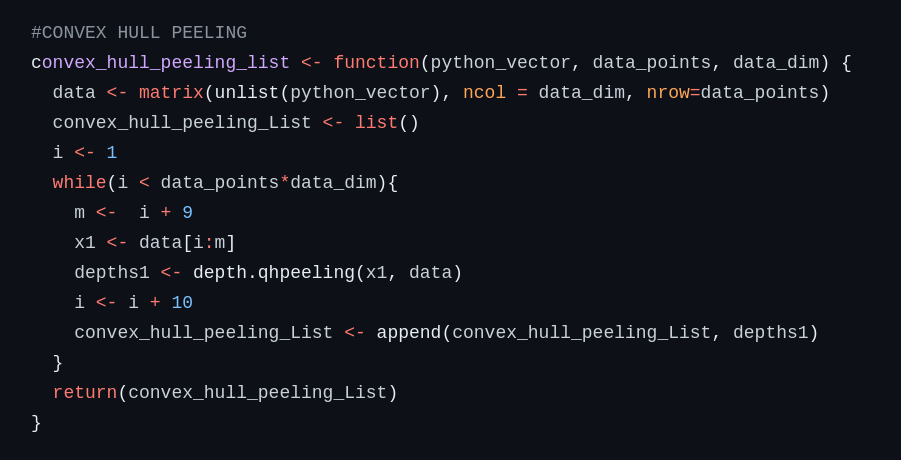
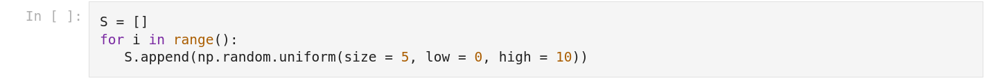
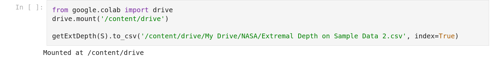

In this directory, you will find files related to data depth.

# DDalpha.R

The ddalpha(1).R file is meant to be used with the "5_29_new_data_PD_vectorization_and_fire_index_(useful).ipynb" python notebook.

This section will strictly cover the ddaplha(1).R file.

In this file you will find a varietly of data depth functions. Most of these functions are currently set to be used with data that is in R^10.

In order to change this, replace the line 

"i <- 10" with "i <- DIMENSION_OF_YOUR_DATA"

# Extremal Data Depth

In the cell below, you will add your data in "S = []".

Example: S = [np.array([0.00000000e+00, 0.00000000e+00, 2.20226974e-03, 2.55981458e-05,
       0.00000000e+00, 4.04072202e-04, 2.44819312e-03, 5.71364980e-05,
       1.47914876e-02, 2.69711764e-02]), np.array([0.00099335, 0.00380378, 0.03290286, 0.01621584, 0.0440664 ,
       0.11532577, 0.15169396, 0.1701804 , 0.1134536 , 0.0567268 ]))]

After running all cells, you can save the results to a csv in the following cell:

Note: This saves the csv to your Google Drive NOT your local machine.
