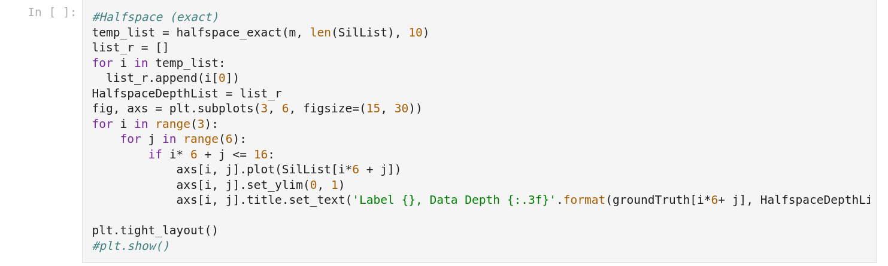

# Background

We first apply topological data analysis to the fire images and obtain their persistent diagrams. This is because a fire is likely to last for multiple timestamps allowingus to track its lifecycle from the persistent diagrams. We can then apply data depth methods on these persistent diagrams and analyze the results. The three main methods we focus on in our research are simplicial volume, halfspace, and extremal. Code to run these methods can be found in the "Data Depth" folder.
## PD Vecotrization Notebook

In this notebook you will find code geared towards running data depth methods on the fire images.

You will need the fire data and the data_depth.R file. The data_depth.R file can be found in the Data Depth folder. 

Be sure to change the directory in the notebook to the location of the fire data on your Google Drive.

When plotting the fire images, you may need to change the width and height of the figure size to accomodate the number of images you are showing at a given time.

### DDAlpha
In the DDalpha section of the notebook, you will find a variety of data depth functions.

The following is the code to run Halfspace Depth:

