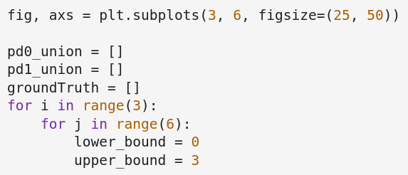

# PD Vecotrization and Fire Index Notebook

In this notebook you will find code geared towards running data depth methods on the fire images.

You will need the fire data and the ddalpha(1).R file. The ddalpha(1).R file can be found in the Data Depth folder. 

Be sure to change the directory in the notebook to the location of the fire data on your Google Drive:

