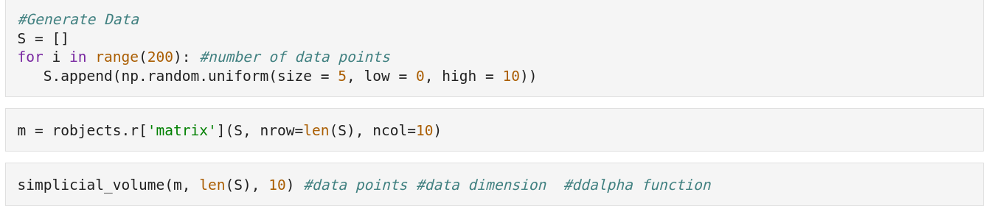

# PD Vecotrization and Fire Index Notebook

In this notebook you will find code geared towards running data depth methods on the fire images.

You will need the fire data and the ddalpha(1).R file. The ddalpha(1).R file can be found in the Data Depth folder. 

Be sure to change the directory in the notebook to the location of the fire data on your Google Drive.

When plotting the fire images, you may need to change the width and height of the figure size to accomodate the number of images you are showing at a given time.

### DDAlpha
In the DDalpha section of the notebook, you will find a variety of data depth functions.
To run a data depth function simply run the corresponding cell. 

The following is the code to run Halfspace Depth:

--------------

You can generate data as shown in the following image:

